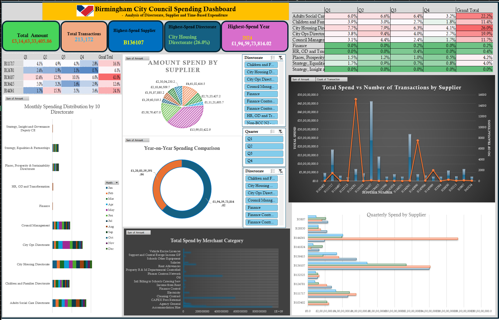

# birmingham-spending-analysis
Excel Dashboard analysing Birmingham City Council spending patterns

# Birmingham City Council Spending Analysis Dashboard

## 📊 Project Overview
This project analyses public spending data from Birmingham City Council using Microsoft Excel. The goal was to explore spending patterns across directorates, suppliers, and time periods, and present insights through an interactive dashboard.

## 🔍 Key Features
- Analysed 213,000+ financial transactions
- Built interactive Excel dashboard using:
  - Pivot Tables
  - Pivot Charts
  - Slicers
  - Conditional Formatting
- Created visualisations for:
  - Total spend by directorate
  - Supplier spending trends
  - Quarterly and yearly analysis
  - Merchant category breakdown

## 📈 Key Insights
- City Housing Directorate accounts for the highest share of spending (~26%)
- A small number of suppliers contribute to a large portion of total expenditure
- Spending shows noticeable quarterly variations, especially in Q2
- Certain categories like Accommodation Hire and Child Transport dominate costs

## 🛠 Tools Used
- Microsoft Excel
- Data Cleaning & Transformation
- Data Visualization
- Exploratory Data Analysis (EDA)

## 📷 Dashboard Preview

## 📁 Files
- `Birmingham-spending-analysis.xlsx` – Full interactive dashboard
- `Dashboard.png` – Snapshot of dashboard

## 🚀 Outcome
This project demonstrates skills in data analysis, dashboard design, and extracting business insights from real-world public datasets.
